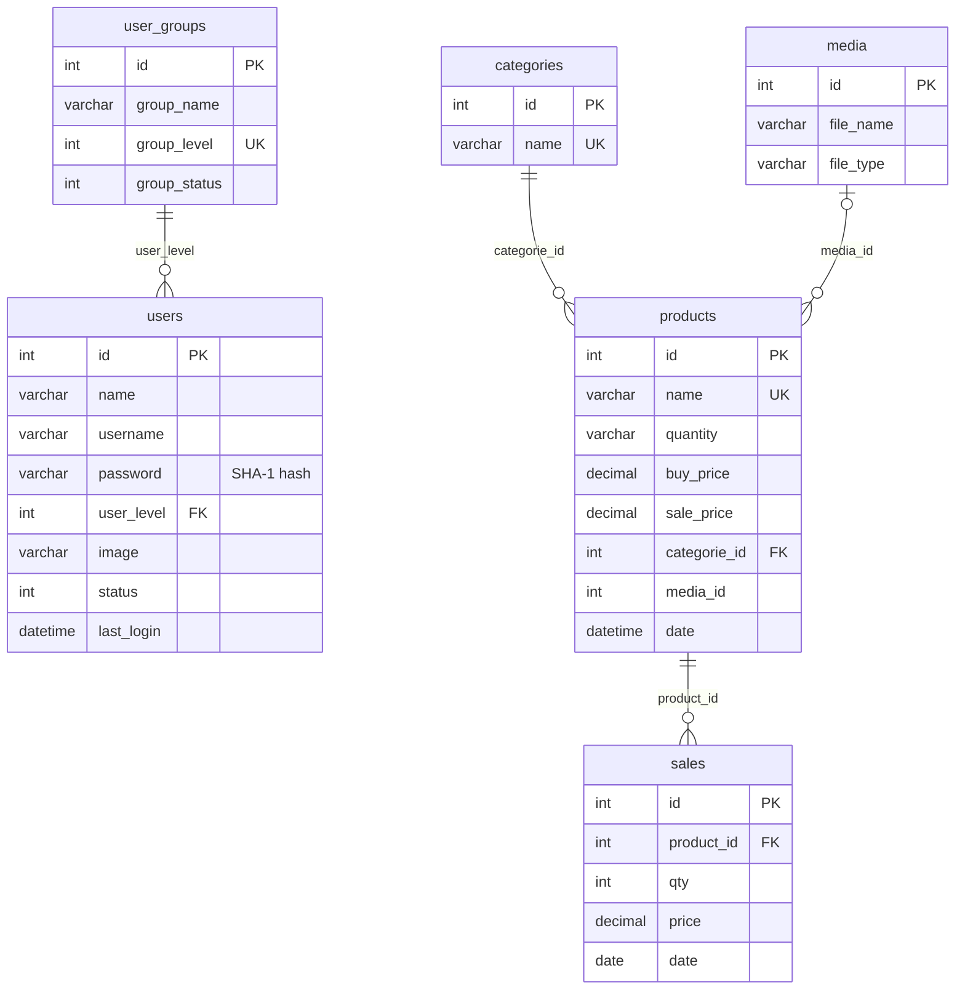

<div align="center">

# Inventory Management System

**A role-based web application for tracking products, stock and sales, with printable sales reports.**


</div>

---

## Table of Contents

- [About](#about)
- [Features](#features)
- [User Roles](#user-roles)
- [Tech Stack](#tech-stack)
- [Getting Started](#getting-started)
- [Demo Accounts](#demo-accounts)
- [Usage](#usage)
- [Project Structure](#project-structure)
- [Database Schema](#database-schema)
- [Security Notes](#security-notes)
- [Troubleshooting](#troubleshooting)
- [Contributing](#contributing)
- [Authors](#authors)
- [Acknowledgements](#acknowledgements)
- [License](#license)

## About

Inventory Management System is a web application that streamlines inventory tracking, stock management and sales reporting for small businesses and warehouses. Products, categories, product photos, sales and reports live in one dashboard, and three user roles (**Admin**, **Special** and **User**) control who can see and change what.

Recording a sale deducts the sold quantity from stock automatically. Reports summarize sales by day and by month, and the date-range report calculates the grand total and profit for any period, ready to print.

<!--
## Screenshots

Save screenshots in docs/screenshots/, then uncomment this section and add "Screenshots" to the table of contents.

| Dashboard | Products | Sales report |
| :---: | :---: | :---: |
|  |  |  |
-->

## Features

### Dashboard

- Live counts of users, categories, products and sales, each linking to its management page
- Highest-selling products, latest sales and recently added products at a glance

### Inventory

- Create, edit and delete products with a category, stock quantity, buying price, selling price and photo
- Organize products into categories
- Media library for uploading product photos (JPG, PNG and GIF)

### Sales

- Product search with as-you-type suggestions (AJAX)
- Sale totals calculated automatically from price × quantity
- Stock deducted automatically when a sale is recorded
- Review, edit and delete past sales

### Reporting

- Sales report for any date range, print-ready, with grand total and profit
- Daily sales for the current month and monthly sales for the current year

### Users and Access Control

- Three roles (Admin, Special and User), each with its own navigation menu
- Every protected page checks the signed-in user's role before it loads
- User and group management; deactivating a group blocks its members from protected pages
- Every user can update their name, username and profile photo, and change their password
- Last sign-in time recorded for each account

## User Roles

| Role | Level | Main areas |
| --- | :---: | --- |
| **Admin** | 1 | Everything: dashboard, users and groups, categories, products, media, sales and reports |
| **Special** | 2 | Products and the media library |
| **User** | 3 | Sales and sales reports |

Access is hierarchical: a lower level number means more privileges, and each role can also open the pages available to the roles below it. Every role can view its profile, edit its account settings and change its password.

## Tech Stack

| Layer | Technology |
| --- | --- |
| Backend | PHP 7.4+ with the MySQLi extension |
| Database | MySQL or MariaDB |
| Frontend | Bootstrap 3.3.4, jQuery 1.11.2, bootstrap-datepicker 1.3.0 |
| Styling | Custom stylesheet (`libs/css/main.css`) |
| Web server | Apache, e.g. via XAMPP, WAMP, MAMP or LAMP |

## Getting Started

### Prerequisites

- A local PHP stack such as [XAMPP](https://www.apachefriends.org/), which bundles Apache, PHP and MariaDB in one installer
- PHP 7.4 or newer with the `mysqli` extension enabled (it is enabled by default in XAMPP)
- MariaDB 10.x, or MySQL 5.7+ with one setting changed (see [Troubleshooting](#troubleshooting))
- An internet connection in the browser: Bootstrap, jQuery and the datepicker load from public CDNs

### Installation

1. **Clone the repository**

   ```bash
   git clone https://github.com/Ahmedali1010/WebProject.git
   ```

2. **Copy the app into your web root.** Copy the `InventorySystem_PHP` folder into your server's document root, for example:
   - XAMPP on Windows: `C:\xampp\htdocs\InventorySystem_PHP`
   - XAMPP on macOS: `/Applications/XAMPP/htdocs/InventorySystem_PHP`
   - Apache on Linux: `/var/www/html/InventorySystem_PHP`

3. **Start Apache and MySQL** from the XAMPP Control Panel, or your stack's equivalent.

4. **Create and import the database.** The SQL file creates the tables and sample data but not the database itself, so create the database first:
   1. Open phpMyAdmin at <http://localhost/phpmyadmin>.
   2. Create a database named `inventory_system`.
   3. Select it, open the **Import** tab and import `InventorySystem_PHP/DATABASE FILE/inventory_system.sql`.

   Or, from the repository root on the command line:

   ```bash
   mysql -u root -p -e "CREATE DATABASE inventory_system"
   mysql -u root -p inventory_system < "InventorySystem_PHP/DATABASE FILE/inventory_system.sql"
   ```

   On a fresh XAMPP install the `root` account has no password, so press <kbd>Enter</kbd> at the password prompt.

5. **Check the database settings** in `includes/config.php`. The defaults match a fresh XAMPP install:

   ```php
   define( 'DB_HOST', 'localhost' );
   define( 'DB_USER', 'root' );
   define( 'DB_PASS', '' );
   define( 'DB_NAME', 'inventory_system' );
   ```

6. **Allow uploads (Linux and macOS only).** Make sure the web server can write to `uploads/products` and `uploads/users`. On a local development machine, `chmod -R 777 uploads` inside the app folder is enough; on a shared server, give ownership to the web server's user instead.

7. **Open the app** at <http://localhost/InventorySystem_PHP/> and sign in with one of the [demo accounts](#demo-accounts).

### Configuration

Paths are relative to the `InventorySystem_PHP` folder.

| Setting | File | Default |
| --- | --- | --- |
| Database host, user, password and name | `includes/config.php` | `localhost`, `root`, empty, `inventory_system` |
| Time zone of the date shown in the header | `layouts/header.php` | `Asia/Baghdad` |
| SQL error output | `includes/database.php` | Development mode, which prints the failing query |

## Demo Accounts

The sample database includes these accounts:

| Role | Username | Password |
| --- | --- | --- |
| Admin | `admin` | `admin` |
| Special | `special` | `special` |
| User | `user` | `user` |

Two more User accounts, `natie` and `kevin`, use the password `password`.

> [!WARNING]
> These credentials are public. Change or delete every sample account before running the system on a shared network or the internet.

The sample data also contains 7 categories, 13 products and 8 sales dated April 4, 2021. Run **Sales by dates** for that day to see a filled-in report.

## Usage

A typical workflow, signed in as `admin`:

1. **Categories:** add the categories you need.
2. **Media Files:** upload product photos.
3. **Products → Add Products:** enter the title, category, photo, quantity, and buying and selling prices.
4. **Sales → Add Sale:** start typing a product name, pick a suggestion and click **Find It**. Adjust the quantity (the total updates automatically), then click **Add sale**. The product's stock drops by the quantity sold.
5. **Sales Report:** choose **Sales by dates** for a printable report with grand total and profit, or open **Daily sales** or **Monthly sales**.
6. **User Management:** create accounts, assign each one a role, and activate or deactivate groups.

## Project Structure

```text
WebProject/
├── README.md
└── InventorySystem_PHP/
    ├── DATABASE FILE/
    │   └── inventory_system.sql   # Database schema and sample data
    ├── includes/
    │   ├── config.php             # Database connection settings
    │   ├── load.php               # Loads all the includes below
    │   ├── database.php           # MySQLi wrapper class
    │   ├── session.php            # Sign-in session and flash messages
    │   ├── sql.php                # Queries, authentication and permission checks
    │   ├── functions.php          # Helpers: escaping, redirects, dates, totals
    │   ├── upload.php             # Image upload handling (Media class)
    │   └── backup/                # Earlier versions of functions.php and sql.php
    ├── layouts/                   # Header, footer and one sidebar menu per role
    ├── libs/
    │   ├── css/main.css           # Custom styles
    │   └── js/functions.js        # Product search, sale totals, datepicker
    ├── uploads/
    │   ├── products/              # Product photos
    │   └── users/                 # Profile photos
    ├── index.php                  # Sign-in page
    ├── auth.php, logout.php       # Sign-in and sign-out handlers
    ├── admin.php                  # Admin dashboard
    ├── home.php                   # Home page for the Special and User roles
    ├── product.php                # Products (+ add_, edit_, delete_product.php)
    ├── categorie.php              # Categories (+ edit_, delete_categorie.php)
    ├── media.php                  # Media library (+ delete_media.php)
    ├── sales.php                  # Sales (+ add_, edit_, delete_sale.php)
    ├── ajax.php                   # Product search endpoint for the sale form
    ├── sales_report.php           # Date-range report form (→ sale_report_process.php)
    ├── daily_sales.php            # Current month, by day
    ├── monthly_sales.php          # Current year, by month
    ├── users.php                  # Users (+ add_, edit_, delete_user.php)
    ├── group.php                  # Groups (+ add_, edit_, delete_group.php)
    └── profile.php, edit_account.php, change_password.php
```

## Database Schema

The database is named `inventory_system` and has six tables:




Portions of this project are derived from [OSWA-INV](https://github.com/siamon123/warehouse-inventory-system), Copyright (c) 2015 Siamon Hasan, and are used under the [MIT License](https://github.com/siamon123/warehouse-inventory-system/blob/master/LICENSE).
